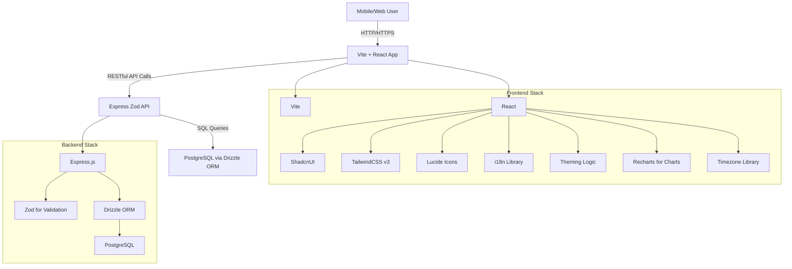

# MeowDo - Goals, Tasks, and Time Tracker Web App

MeowDo is a mobile-friendly web application designed for tracking and managing goals, tasks, and time. With a focus on mobile users, it prioritizes responsiveness and a mobile-first design to ensure accessibility and usability on the go.

## Table of Contents
- [Overview](#overview)
- [Key Features](#key-features)
- [User Experience Goals](#user-experience-goals)
- [System Architecture](#system-architecture)
- [Tech Stack](#tech-stack)
- [Development Setup](#development-setup)
- [Current Status](#current-status)
- [What's Left to Build](#whats-left-to-build)
- [Known Issues](#known-issues)
- [Contributing](#contributing)
- [License](#license)

## Overview

MeowDo aims to provide a comprehensive solution for individuals to manage their goals, tasks, and time effectively. It addresses common challenges in organization and productivity by offering a structured approach to defining objectives and tracking progress.

### Problems Solved
- **Disorganization**: Organizes goals and daily tasks within defined workspaces.
- **Time Management**: Budgets time for tasks with warnings for over-allocation.
- **Task Tracking**: Provides status indicators and granular time tracking.
- **Prioritization**: Assigns priority levels to tasks.
- **Personalized Experience**: Supports timezone preferences for accurate time data.
- **Goal Achievement**: Offers a framework for setting and tracking goals.
- **Mobile Accessibility**: Designed with a mobile-first approach.

## Key Features

1. **Workspaces**: Users can define and manage multiple workspaces.
2. **Goals**: Within each workspace, users can set goals with names, descriptions, optional deadlines, and status (`pending`, `reached`).
3. **Tasks**: Daily tasks can be defined for each goal with features including:
   - Time budget assignment and daily total calculation with a warning if exceeding 24 hours.
   - Option to copy tasks to the next day (recurring tasks).
   - Optional deadlines and status tracking (`pending`, `started`, `failed`, `done`).
   - Priority levels (default 1, highest 10).
   - Start/stop tracking with time record insertion and summaries displayed in bar charts using Recharts.
4. **User Preferences**: Users can specify and store their timezone preference for accurate time displays.
5. **Manual Time Record Entry**: Allows users to manually input start and stop times for tasks.
6. **Workspace Sharing**: Users can share workspaces with others, manage permissions (view, edit, delete), and accept or decline invitations to collaborate on shared workspaces.

## User Experience Goals

- **Intuitive and User-Friendly**: Easy navigation and understanding for all users.
- **Efficient Workflow**: Quick addition, modification, and tracking of goals and tasks.
- **Visually Appealing**: Clean, modern design using ShadcnUI, TailwindCSS, and Lucide Icons.
- **Responsive**: Seamless adaptation to various screen sizes, prioritizing mobile experience.
- **Accessible**: Multi-language support (English, Arabic, Farsi), light/dark modes, and RTL/LTR layouts.
- **Motivating**: Features to encourage users to stay on track and achieve goals.

## System Architecture

MeowDo follows a client-server architecture with a clear separation between frontend and backend.

### Key Technical Decisions
- **API Design**: RESTful API with Zod for validation.
- **Database Schema**: Managed by Drizzle ORM for type safety.
- **State Management**: React Context and `localStorage` for theme persistence.
- **Authentication/Authorization**: JWT for multi-user support.
- **Internationalization**: Dedicated i18n library for multi-language and RTL/LTR support.
- **Theming**: CSS variables and TailwindCSS for light/dark mode.
- **Time Management & Tracking**: Precise timestamping with timezone consideration.
- **Charting**: Recharts for visualizing task time spent.
- **PWA Caching**: Aggressive caching strategy with `vite-plugin-pwa` and Workbox.

## Tech Stack

### Backend
- **Runtime**: Node.js
- **Framework**: Express.js
- **API Validation**: Zod
- **ORM**: Drizzle ORM
- **Database**: PostgreSQL
- **Language**: TypeScript

### Frontend
- **Build Tool**: Vite
- **Library**: React
- **UI Components**: ShadcnUI
- **Styling**: TailwindCSS v3
- **Icons**: Lucide Icons
- **Language**: TypeScript
- **Internationalization**: `react-i18next` or similar
- **State Management**: React Context, `localStorage`
- **Charting**: Recharts
- **Timezone Handling**: `luxon` or similar

## Development Setup

### General
- **Package Manager**: npm (standardized)
- **Version Control**: Git
- **Code Editor**: VS Code (recommended extensions: ESLint, Prettier, Tailwind CSS IntelliSense, Drizzle Kit)

### Backend Specific
- **Database Setup**: Local PostgreSQL or Dockerized container.
- **Environment Variables**: `.env` file for sensitive information.
- **Migrations**: Drizzle Kit for schema migrations.

### Frontend Specific
- **Vite Configuration**: Standard setup for React with TypeScript.
- **TailwindCSS Configuration**: Custom themes and utility classes.
- **ShadcnUI Setup**: Initialize with `npx shadcn@latest init` and add components as needed.

### Quick Start with Docker
1. Ensure Docker and Docker Compose are installed.
2. Copy `.env.example` to `.env` and adjust variables if needed (`BACKEND_PORT`, `FRONTEND_PORT`, `VITE_API_BASE_URL`).
3. Run `docker-compose up --build` to start the backend, frontend, and database services.

## Current Status

The project has completed its initial setup phase with significant progress on both backend and frontend. All core backend features are implemented, including user authentication, workspace, goal, and task management. Frontend components for authentication, workspace, goal, and task management are integrated with the backend API using `fetch`. Multi-language support (English, Arabic, Farsi) and light/dark mode theming are fully configured. Docker setup for containerization is complete, with environment variables for port mappings and API URLs.

Key features like user timezone preference, task priority, start/stop tracking, time spent summaries with Recharts, manual time record entry, and theme preference storage are implemented. RTL/LTR layout issues have been resolved with directionality-agnostic TailwindCSS utilities.

## What's Left to Build

- **Enhancements**:
  - Comprehensive error handling.
  - Unit and integration tests for backend and frontend.
  - Deployment pipeline setup.
  - Performance optimizations.

## Known Issues

- None at this time.

## Contributing

Contributions are welcome! Please fork the repository, make your changes, and submit a pull request. Ensure your code adheres to the project's coding standards and includes appropriate tests.

## License

This project is licensed under the MIT License - see the [LICENSE](LICENSE) file for details.
