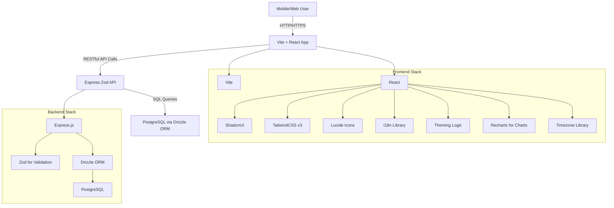

# System Patterns: MeowDo

## System Architecture

MeowDo will follow a client-server architecture with a clear separation between the frontend and backend.

## Key Technical Decisions

*   **API Design:** RESTful API principles will be followed for communication between frontend and backend. Zod will be used for robust request and response validation.
*   **Database Schema:** Drizzle ORM will be used to define and manage the PostgreSQL database schema, ensuring type safety and efficient query building.
*   **State Management (Frontend):** A suitable React state management solution (e.g., React Context, Zustand, Jotai, or Redux Toolkit depending on complexity) will be chosen to manage global application state.
*   **Authentication/Authorization:** Multi-user support will be implemented using JWT (JSON Web Tokens) for authentication, passed via the `Authorization` header.
*   **Internationalization:** A dedicated i18n library will be integrated into the frontend for multi-language support, ensuring compatibility with both Left-to-Right (LTR) and Right-to-Right (RTL) layouts.
*   **Theming:** CSS variables and TailwindCSS will be leveraged for easy implementation and switching between light and dark modes.
*   **Time Management & Tracking:** Implementation will involve precise timestamping and duration calculations, considering user-defined timezones.
*   **Charting:** Recharts will be used for visualizing time spent on tasks.
*   **Prioritization:** Task prioritization will be managed via an integer field in the database and exposed through API.
*   **PWA Caching Strategy:** The PWA will utilize `vite-plugin-pwa` with Workbox to implement an aggressive caching strategy, including `cleanupOutdatedCaches`, `skipWaiting`, and `clientsClaim` to ensure immediate updates and cache invalidation on new deployments.

## Design Patterns in Use

*   **MVC/Layered Architecture (Backend):** Separation of concerns with distinct layers for routing, controllers, services/business logic, and data access.
*   **Component-Based Architecture (Frontend):** Reusable and modular React components for building the UI.
*   **Repository Pattern (Backend):** Abstracting data access logic to provide a clean interface for interacting with the database.
*   **Dependency Injection:** Potentially used in the backend for managing service dependencies.

## Component Relationships

*   **Workspaces:** Top-level entities containing multiple Goals.
*   **Goals:** Contain multiple Tasks.
*   **Tasks:** Individual units of work with time budgets and statuses.
*   **User Interface:** Built from smaller, reusable ShadcnUI components styled with TailwindCSS.

## Critical Implementation Paths

*   **Workspace Management:** CRUD operations for workspaces.
*   **Goal Management:** CRUD operations for goals within a workspace.
*   **Task Management:** CRUD operations for tasks associated with goals, including time budget calculations, recurring task logic, status updates, and priority management.
*   **Task Time Tracking:** Implementing start/stop functionality for tasks, recording time spent, and generating daily/monthly/yearly summaries.
*   **User Authentication:** Secure user registration, login, and session management.
*   **User Timezone Management:** Allowing users to set and update their preferred timezone.
*   **Mobile Responsiveness:** Ensuring all UI elements and interactions are optimized for mobile devices.
*   **Multi-language Support:** Implementing the ability to switch between English, Arabic, and Farsi seamlessly, including full support for RTL/LTR layouts.
*   **Theming:** Allowing users to toggle between light and dark modes.
